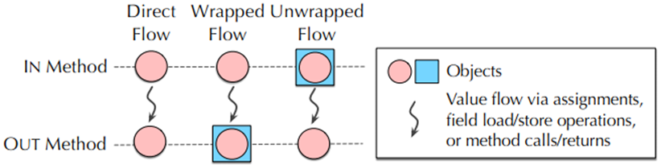
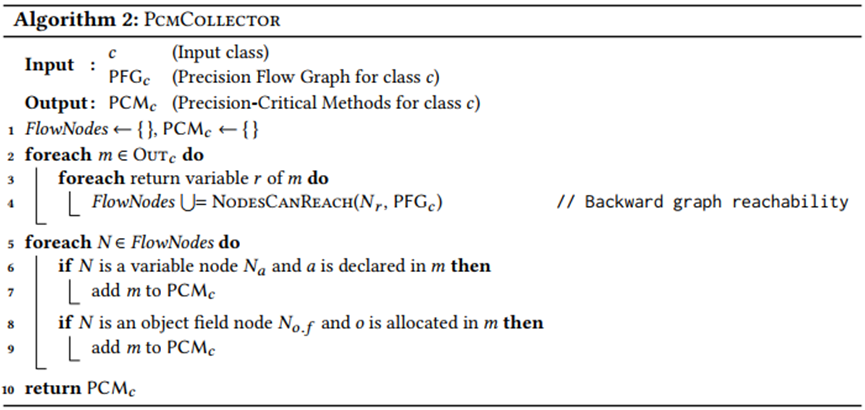
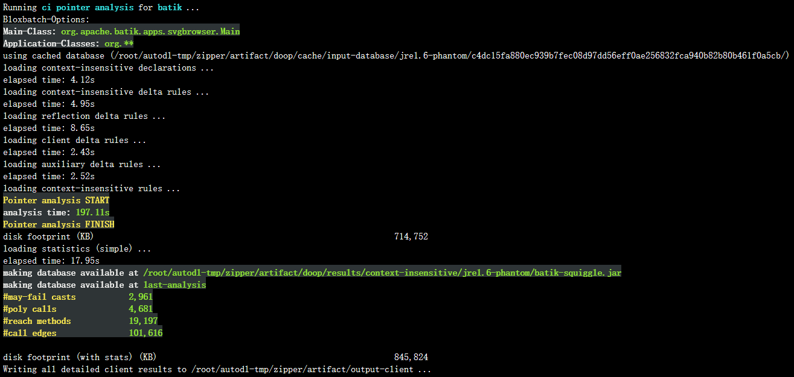

# “Precision-Guided Context Sensitivity For Pointer Analysis”的解读与实现

<center>谢凌祥20344064 | 杨翼飞 20303068 | 肖荣亿 20302199</center>

[TOC]

## 组员分工

| **成员** |   **所做任务**   | **贡献占比** |
| :------: | :--------------: | :----------: |
|  谢凌祥  |   论文阅读分析   |     33%      |
|          |  ReadMe文档编写  |              |
|          | 报告主体框架搭建 |              |
|          |     资料收集     |              |
|          |     报告撰写     |              |
|  杨翼飞  |   论文阅读分析   |     33%      |
|          |  ReadMe文档编写  |              |
|          |   实验代码详解   |              |
|          | 运行论文相关实验 |              |
|          |   论文结果复现   |              |
|  肖荣亿  |   论文阅读分析   |     33%      |


## 摘要

程序分析是保障大规模复杂软件可靠性、安全性、性能等质量指标的关键技术，而指针分析是程序分析中非常重要的部分。运用上下文敏感技术可以提升指针分析准确率的重要技术，然而，并不是所有函数在运用上下文敏感技术后都能使准确度得到提升，因此，仅对可提升准确率的函数进行上下文敏感的指针分析可以有效提升指针分析的效率。但是目前关于上下文敏感的技术大多基于启发式的角度，并没有去深入了解被分析方法各自的特征。因此本篇论文的作者对上下文敏感技术可提高精度的函数进行了研究，并归纳出三种数据流模型，从而针对性使用上下文敏感指针分析技术，在保证准确率的前提下大幅加速指针分析。


## 论文内容详解

### 介绍

过去几十年间，人们发展了很多分析技术来使得指针分析更加精确和高效，尤其是针对面向对象语言。其中最成功的保证高精确度的想法是上下文敏感，它允许在不同的上下文环境下分析每个程序方法，从而分离方法变量的不同动态实例化的静态抽象，减少虚假的对象流。但尽管上下文敏感能带来高精确度，但它的效率却很低下。其中一个原因是，在传统的上下文敏感技术中，程序中的每个方法都被视为相同的，这意味着许多不受益于上下文敏感的方法都被冗余地分析了多个上下文，这就会导致大量的时间被花费，从而降低效率。

很自然的一个问题是我们能否选择性地运用上下文敏感，仅仅对于有利于整体分析精度的方法使用。以往的技术基于似乎与不精确性相关的启发式方法，但是它们没有提供在上下文不敏感的指针分析中不精确性如何发生以及哪里引入的全面理解。

在本文中，作者提供了一个更有规则的方法，称为ZIPPER，该方法基于对如何引入不精确的深入了解，可以有效识别精度关键方法。作者观察到的一个关键的现象是，不精确性在上下文不敏感的指针分析中出现的大多数情况都符合数据流的三种一般模式，作者称之为直接、包装和拆封流。此外，作者发现这三种数据流均可以被有效地识别。基于从快速的、上下文无关的指针分析中获得的信息，ZIPPER构建了一个精确的指针流图(PFG)，该图简洁地模拟了相关的数据流。与指针分析本身相比，精度关键方法的辨识可以表述为PFG上的图可达性问题，并且可以在可忽略的时间内求解。通过将上下文敏感应用于ZIPPER所确定的精度关键方法，指针分析比传统技术运行速度快得多，同时保留了大部分精度。

---

### 论文贡献

+ 描述了三种基本的数据流模式，即直接、包装和拆封流。它们有助于解释在上下文不敏感的指针分析中大多数的不精确性如何以及在何处引入。
+ 提出了ZIPPER方法来有效地识别三种数据流模式，从而识别从上下文敏感性中受益的精度关键方法。ZIPPER可以指导上下文敏感的指针分析运行得更快，同时保持其大部分精度。与选择性地应用上下文敏感性的其他技术相比，ZIPPER方法基于对不精确性的切实理解，而不是基于机器学习等需要参数调整的启发式方法。
+ 提供了有关ZIPPER算法的广泛实验评估，以验证其有效性。平均而言，ZIPPER指明只有38% 的方法是精度至关重要的，对于具有上下文敏感堆的2对象敏感指针分析，这种方法保留了98.8% 的精度，加速比为3.4，最高可达9.2。

---

### 造成上下文不敏感指针分析不精确的原因

我们先来看一个例子。如下图所示，如果对方法m进行上下文不敏感的分析，那么对象A和B就会混合在一起，从而得出x2和y2可能同时指向A对象和B对象的错误结论。相比之下，上下文敏感的分析会对m进行两次分析，分别对应于两个不同的调用点，从而得出x2只指向A对象，y2只能指向B对象的正确结论。通过这个例子我们可以有一个大概的认识：上下文不敏感分析不区分方法的不同对象调用会导致精度损失。

```java
Object m(Object o){
    return o;
}
x1=new A();
x2=m(x1);
y1=new B();
y2=m(y1);
```


<p align = center>
图1
</p>


为了进一步描述上下文不敏感指针分析不精确的原因，作者归纳并提出了三种精度损失模式，接下来我们逐一对这三种模式进行介绍。首先我们先介绍几个定义：

+ 定义一，IN和OUT方法。给定一个类C和一个在C中声明或继承的方法M，如果M包含参数，那么M就是C的IN方法，如果M的返回类型不是void，那么M就是C的OUT方法。比如在图1的例子中，m 即是其所在类的IN和OUT方法。

+ 定义二，对象包装和拆封。如果对象O存储在对象W的字段中，我们说O被包装到W中。相反，如果从对象W的字段加载对象O，我们说从W拆封对象O。

 根据上面两个定义，我们可以将三种精度损失模式描述为图2所示的数据流，我们接下来详细看看这三种数据流模式。



<center> 图2 </center>

#### 模式1：直接流

首先我们来看看直接流的定义：如果程序的一个对象O作为参数传递给C类的IN方法M1，然后通过一系列操作后流到同一个C类的OUT方法M2的返回值，那么我们说程序有从M1到M2的直接流。图3所示的setName和getID方法即是一个完整的直接流过程。对象nm从Person类的IN方法setName流入，最后从OUT方法getID流出。


<center> 图3 </center>

接下来看看直接流模式是如何导致精度损失的。如图3所示，可以看到，若执行此代码，第21行中的id1本应只指向第19行中的对象1。但是如果我们使用上下文不敏感的指针分析，id1和id2都将指向对象1和2，这显然导致了结果的不精确。

#### 模式2：包装流

我们同样先看包装流的定义：如果程序的一个对象O作为参数传递给C类的IN方法M1，然后O被包装到对象W中，W随后流向C类的OUT方法M2的返回值，那么我们说程序有从M1到M2的包装流。


<center> 图 4 </center>

图4中的Collection类和Iterator类的三个方法即构成一个完整的包装流。首先对象1和2流入Collection类的IN方法add，然后流入Iterator类的构造方法Iterator中并被包装，最后包装对象从Collection类的OUT方法iterator中流出。整个流动过程如图4右侧的蓝色箭头所示。

通过分析图4代码的执行过程我们可以发现，理论上第28行中的对象o1应指向对象1。然而，如果我们尝试对Collection类和Iterator类中四个方法的任何一个进行上下文不敏感的分析，若图4右侧所示，结果却是o1同时指向对象1和2，从而导致了精度损失。

#### 模式3：拆封流

我们同样先看包装流的定义：如果程序的一个对象O作为参数传递给C类的IN方法M1，然后从O中拆封一个对象U，U随后流向同一个C类的OUT方法M2的返回值，那么我们就说程序从M1到M2有拆封流。

如图5所示，两个Box对象b1和b2先从作为IN方法的SyncBox类的构造函数中流入，然后进一步流入第8行中的b。随后在第9行调用的OUT方法getItem中，b1和b2拆封的对象从该方法中流出，构成一个完整的拆封流。整个流动过程如图5右侧的蓝色箭头所示。


<center> 图 5</center>

分析代码执行过程可以发现，第29行中的o1应只指向对象1。但是如图5右侧所示，通过上下文不敏感的分析我们可以看到，Box对象b1和b2被合并在相同的指向集中并且沿着拆封流进一步传播，从而导致接收变量(在本例中为 o1和o2)指向虚假对象，导致了精度的损失。

#### 数据流模式的组合

最后要补充的是，一些不精确性只能用组合来描述。考虑一个流入IN方法的包装器对象W，然后对象O从W中被拆封出来，然后将O被包装到另一个包装器对象 W’中，该对象从同一类的OUT方法流出。在这种情况下可能会出现精度损失，然而上面所说的三种数据流模式中却没有一种与此匹配，因此只能通过拆封流和包装流的组合来捕获它。接下来我们所要阐述的ZIPPER方法不仅可以识别之前介绍的三种模式，也可以识别这种组合。作者的实验表明，这些模式及其组合基本上解释了上下文不敏感分析中可能出现的所有不精确性。

---

### ZIPPER概述

上一部分我们成功地描述了在上下文不敏感的分析中导致精度损失的主要原因，但是这里对于静态分析方法而言仍然存在两个挑战：首先，精度损失模式是用动态执行术语定义的，而ZIPPER必须使用静态（程序运行前）的信息捕获这些可能存在的精度损失；其次，有用的静态信息必须可以仅从上下文不敏感的分析中计算出来，以便指导上下文敏感的分析。也就是说，潜在的精度损失必须从已经表现出这种损失的分析中检测出来。ZIPPER通过有效识别给定程序中的精度关键方法解决了这些问题，同时保持了大部分的精度。其中精度关键方法可以理解为与三种精度损失模式相关的方法。

ZIPPER的核心之一是精度流图(PFG)的概念，它允许我们以统一的方式表达所有三种精度损失模式，每种精度损失模式都可以用PFG中的路径来表示。通过PFG，我们可以将识别精度关键方法的问题转化为抽象图计算问题。通过求解PFG上一个简单的图可达性问题，可以有效地提取三种流中任意一种流的所有可达方法。

构建PFG需要知道对象在程序中如何流动的信息，因此作者利用了对象流图（OFG）的概念（下一小节介绍）。程序的OFG可以跟踪对象的流动，因此它可以自然地表达直接流。然而，原始的OFG公式并不能直接表达包装流和拆封流，因此不能直接使用它来识别精度关键的方法。出于这个原因，作者在 OFG 之上构建了PFG，以统一表达三种精度损失模式。

图6显示了ZIPPER的总体结构，它本身包含三个组件: 对象流图、精确流图和图可达性计算。整体的分析过程是这样的：首先，对ZIPPER进行一个快速但不精确的上下文不敏感的指针分析作为预分析。为了简化讨论，作者假设预分析通过对象的调用位置（第几行）来抽象对象，当然其他对象抽象也是可以的。这个预分析以关系pt(v)的形式为OFG的构造提供信息，其中关系pt(v)捕获每个变量v的指向集。基于OFG，ZIPPER为每个类构造一个PFG，然后计算每个PFG 上的图可达性，以确定哪些方法是精度关键的。最后，在ZIPPER分析结果的指导下，选择性进行上下文敏感指针分析，使指针分析仅对ZIPPER报告的精度关键方法进行上下文敏感分析。


<center> 图 6</center>

#### 对象流图

程序的对象流图(OFG)是表示对象在程序中如何流动的有向图。OFG中的节点表示指向对象的程序指针，边表示指针之间的对象流。OFG 将程序中的每个变量以及每个抽象对象的每个字段设置成一个节点。对象的抽象方式如上文所述，作者在这里使用调用位置（第几行）的抽象方式。OFG中的边a→b意味着指针a指向的对象可能流向指针b。图7展示了对象流图的一个例子。


<center> 图 7 </center>

图7左侧展示了对象流的四种基本方式以及它们所对应的Java语句，现在来看看图7右侧所举的对象流图的例子。程序的语句由上至下依次被标识为①到⑤，每条语句都会导致对象流图上一条新边的产生。在对象流图中，只需检查图的可达性即可直接获得对象流信息，无需显式跟踪变量之间的别名信息或字段访问。例如，变量e可以从OFG中的b到达，这意味着b指向的对象可以流向e，即由e所指向。因此，直接流可以由对象流图（OFG）中的路径自然地表示。

#### 精确流图和图可达性

首先是PFG的构建。正如上面所述，OFG 是为整个程序构建的，而PFG是相对于一个类定义的，我们为程序中的每个类构造一个PFG。构建PFG的任务是添加可以表示其他两种流的边: 包装流和拆封流。算法1展示了如何为给定的类C构建PFG。作者为了简单起见，用图的边集来表示PFG和OFG，图的节点则隐式地出现在边集中。


<center> 算法1 </center>

接下来我们看看如何进行图可达性计算，以及ZIPPER如何基于PFGs提取精度关键方法。通常情况下，ZIPPER首先通过求解PFG上的一个简单图可达性问题计算三种流中涉及的所有节点，然后收集包含这些节点的方法作为精度关键方法。给定一个类C，精度损失模式中的每个流对应于从C的IN方法的参数节点到PFG中C的OUT方法的返回变量节点的路径。因此，获取流中涉及的语句等价于计算IN方法的参数可以访问哪些节点。由于ZIPPER从IN方法的参数开始构建PFG(算法1中的第2-3行) ，因此可以从IN方法访问PFG中的所有节点，我们只需要找出PFG中的哪些节点可以到达类C的OUT方法的返回变量。算法2定义了基于PFG的输入类C的精度关键方法的集合。



<center> 算法2 </center>

算法2负责收集给定程序中每个类的精度关键方法，有了这些信息，ZIPPER就可以指导上下文敏感的指针分析仅对精度关键的方法应用上下文敏感。通过算法1和算法2的综合应用，我们就可以提高上下文敏感技术的速度与准确度，ZIPPER总体方法总结如下面的图8所示。


<center> 图8 </center>

---

### 评估

实验数据表明，ZIPPER判断出的精度要求严格的方法大约占所有方法的38%，如下所示：


<center> 图9 </center>

对于精度而言，ZIPPER能达到对所有函数都应用上下文敏感的指针分析的精确度的98.8%，如下所示：


<center> 图 10 </center>

而分析用时却比传统方法少了许多，速度快了3.4到9.2倍，如下所示：


<center> 图 11 </center>

以上数据表明，ZIPPER：

1. 保持了绝大部分的精确度
2. 显著地提升了运行速度

---

### 总结

上下文敏感是保证 Java 指针分析高精度的重要技术。在本文中，作者提出了ZIPPER: 一个基于原则的方法来确定精度关键方法。

  本篇论文的概念贡献包括数据流的三种基本模式(直接的、包装的和拆封的流) ，它们解释了在上下文不敏感的指针分析中引入最不精确的地方和方式，以及精确流图的概念，这些图简明地模拟了相关的数据流。其他贡献包括ZIPPER方法的实现和实验，证明了该技术在实际Java程序中的有效性。实验结果表明，这三种精度损失模式成功地捕获了绝大多数受益于上下文敏感的分析方法，从而在保留传统上下文敏感指针分析所有精度的同时，获得了显著的分析加速效果。


## 代码详解

### 代码结构简述

代码仓库在Github中的链接为：（https://github.com/silverbullettt/zipper/blob/master/zipper/src/ptatoolkit/zipper/analysis/Zipper.java）。

仓库的不完整的文件树如下图所示，我将在文件树中对于仓库各重要文件夹和文件的功能进行注解。

```bash
ZIPPER
│   LICENSE.txt
│   README.md
├───doop						# DOOP 代码分析框架
│   │   doop.conf
│   │   export  
│   │   gen-export
│   │   gen-import
│   │   LICENSE
│   │   run                     # DOOP代码框架运行脚本
│   │   run-zipper.py           # DOOP + ZIPPER 运行脚本
│   │
│   ├───bin
│   ├───externals
│   │   └───jre1.6.0_24
│   ├───jars
│   ├───lib
│   ├───logic
│   ├───scripts
│   └───utils
└───zipper					    # ZIPPER 
    │   compile.sh			    # ZIPPER 编译脚本
    │
    ├───build
    │       zipper.jar          # 提供的编译好的jre包
    └───src
        └───ptatoolkit          # ZIPPER 实现代码
            │   Global.java     # 全局变量定义
            │   Options.java    # 指令存储和运行
            ├───doop			# DOOP 框架相关工具函数
            │   ├───basic
            │   └───factory
            ├───pta				# 指针分析相关工具函数
            │   ├───basic
            │   └───util
            ├───util			# ZIPPER 运行工具函数
            │   │   ANSIColor.java
            │   │   MutableInteger.java
            │   │   Pair.java
            │   │   SetFactory.java
            │   │   Timer.java
            │   │   Triple.java
            │   │   UnionFindSet.java
            │   │
            │   └───graph 		# 图相关的工具函数
            └───zipper			# ZIPPER 核心代码，将在下一节中详细分析
```

我们可以看到，正如论文中提到的 ZIPPER 可以作为一种成熟的指针分析框架的指引工具，仓库将 ZIPPER 和 DOOP 指针分析框架相结合，成为一个可以完整复现论文所有结果的 ZIPPER 指针分析工具。

 仓库根目录由两个文件夹组成，`zipper` 文件夹中保存着一个 DOOP 程序分析框架，仓库推荐为 DOOP 框架使用的 Datalog 引擎为[PA-Datalog](http://snf-705535.vm.okeanos.grnet.gr/agreement.html)。在李越老师为这篇论文提供的 [Artifact](https://yuelee.bitbucket.io/software/zipper/) 中，这个文件夹中还包括了待分析的程序源代码。文件夹中还包括了运行指针分析所需要的配置和脚本，其中，run 脚本为 DOOP 的运行脚本，而  `run-zipper.py` 则是使用 ZIPPER 的 DOOP 运行Python脚本（使用 Python 2 执行）。

而 `zipper` 文件夹中就是我们所要研究的 ZIPPER 的 Java 代码实现了。在 `zipper` 文件夹下，[`compile.sh`](https://github.com/silverbullettt/zipper/blob/master/zipper/compile.sh) 是一个ZIPPER 工具对应的 Java 编译脚本，在 `JAVA_HOME` 设置正确的 JDK 1.8 的Linux 机器上可以执行该脚本编译 ZIPPER 工具。作者也在 `build` 文件夹下提供了一个编译完成的包括 ZIPPER 和之后的 ZIPPER-e 的 jar包。

`src` 文件夹中保存着ZIPPER的实现代码，其包名为 `ptatoolkit`。在包下共由四个文件夹和两个Java文件。其中 `options.java` 为项目运行时保存有关选项的指令类，`global.java`为一些全局变量的定义；`util` 文件夹保存着一些显示所需的工具类；`doop`文件夹中，实现了需要的一些指针分析工具；`pta`文件夹中实现了一个基本的指针分析算法；而 `zipper` 文件夹中就是最核心的实现了。

---

### 各组件功能详解

`zipper/src/ptatoolkit/zipper`文件夹是项目算法的核心文件夹，和上一节一样，我将对其文件树进行对应的功能标注如下：

```bash
ZIPPER
│   Main.java									# 运行时的main函数
│
├───analysis                                    # ZIPPER 算法实现
│       InnerClassChecker.java        ## 检查一个类是否是另一个类的内部类
│       ObjectAllocationGraph.java    ## object allocation graph (OAG)
│       PotentialContextElement.java  ## 上下文元素计算类
│       Zipper.java					  ## ZIPPER 主类
│
├───doop										# DOOP 指针分析
│       Attribute.java                ## DOOP 有关的一些属性常量设置
│       DoopPointsToAnalysis.java	  ## DOOP 结果的保存和加载
│
├───flowgraph									# 关于流的实现和工具函数
│       Dumper.java
│       Edge.java                     ## OFG 边的定义
│       FlowAnalysis.java             ## 算法1实现
│       InstanceFieldNode.java		  ## OFG Field Node, Node 的子类 
│       IObjectFlowGraph.java         ## OFG 的抽象接口定义
│       Kind.java                     ## 边的类型定义
│       Node.java                     ## OFG 点的父类
│       ObjectFlowGraph.java          ## OFG 的实现
│       VarNode.java                  ## OFG Varible Node, Node的子类
│
└───pta										    # 指针分析函数接口
        PointsToAnalysis.java
```

此文件夹中各类的作用大致如上。下面我们重点介绍 ZIPPER 对应的算法实现。

#### 算法1实现

下面关于算法为了和论文中的算法描述相符，在此统一规定代码注释，在代码上方一行的`/**/`注释即为论文中对应的伪代码。

论文中的算法1是在 `FlowAnalysis.java` 中实现的。类中有以下成员定义：

```java
private final PointsToAnalysis pta; 				  // 指针分析结果
private final ObjectAllocationGraph oag;			  // OAG
private final PotentialContextElement pce; 
private final ObjectFlowGraph objectFlowGraph;        // OFG

private Type currentType;                			  // C
private Set<Variable> inVars;						  // IN_c
private Set<Node> outNodes;							  // OUT_c
private Set<Node> visitedNodes;         		      // VisitedNodes
private Map<Node, Set<Edge>> wuEdges;    			  // WUEdges
private DirectedGraphImpl<Node> pollutionFlowGraph;   // PFG
private Reachability<Node> reachability;
```

下面就是算法1的实现详情了。算法一的实现主要在 `analyze` 函数中，节选和伪代码相关的业务代码实现如下：

```java
public void analyze(Method startMethod) {
    //  foreach parameter p of m do
    for (Variable param : startMethod.getParameters()) {
        Node node = objectFlowGraph.nodeOf(param);
        if (node != null) {
            /* Dfs(Np) where Np is the OFG node for p */
            dfs(node);
        } else {
            ……
        }
    }
    ……
}
```

可以看到和算法1是一一对应的关系。算法1内部调用的 DFS 函数实现如下：

```java
private void dfs(Node node) {
    if (Global.isDebug()) {
        System.out.println(color(BLUE, "Node ") + node);
    }
    if (visitedNodes.contains(node)) { // node has been visited
        /* if N ∈ VisitedNodes then return */
        if (Global.isDebug()) {
            System.out.println(color(RED, "Visited node: ") + node);
        }
    } else {
        /*  add N to VisitedNodes */
        visitedNodes.add(node);
        pollutionFlowGraph.addNode(node);
        /* add unwrapped flow edges */
        if (Global.isEnableUnwrappedFlow()) {
            /*  if N is a variable node Na then */
            if (node instanceof VarNode) {
                VarNode varNode = (VarNode) node;
                Variable var = varNode.getVar();
                // Optimization: approximate unwrapped flows to make
                // Zipper and pointer analysis run faster
                /* foreach b = a.f ∈ S do // Handling unwrapped flow */
                pta.returnToVariablesOf(var).forEach(toVar -> {
                    Node toNode = objectFlowGraph.nodeOf(toVar);
                    if (outNodes.contains(toNode)) {
                        for (Variable inVar : inVars) {
                            if (!Collections.disjoint(pta.pointsToSetOf(inVar),
                                                      pta.pointsToSetOf(var))) {
                                Edge unwrappedEdge =
                                    new Edge(Kind.UNWRAPPED_FLOW, node, toNode);
                                /*  add N a → N b to WUEdges */
                                addWUEdge(node, unwrappedEdge);
                                break;
                            }
                        }
                    }
                });
            }
        }
        /* foreach o ∈ pt(b) do */
        List<Edge> nextEdges = new ArrayList<>();
        for (Edge edge : outEdgesOf(node)) {
            switch (edge.getKind()) {
                case LOCAL_ASSIGN:
                case UNWRAPPED_FLOW: {
                    nextEdges.add(edge);
                }
                    break;
                case INTERPROCEDURAL_ASSIGN:
                case INSTANCE_LOAD:
                case WRAPPED_FLOW: {
                    // next must be a variable
                    VarNode next = (VarNode) edge.getTarget();
                    Variable var = next.getVar();
                    Method inMethod = pta.declaringMethodOf(var);
                    // Optimization: filter out some potential spurious flows due to
                    // the imprecision of context-insensitive pre-analysis, which
                    // helps improve the performance of Zipper and pointer analysis.
                    if (pce.PCEMethodsOf(currentType).contains(inMethod)) {
                        nextEdges.add(edge);
                    }
                }
                    break;
                case INSTANCE_STORE: {
                    InstanceFieldNode next = (InstanceFieldNode) edge.getTarget();
                    Obj base = next.getBase();
                    if (base.getType().equals(currentType)) {
                        // add wrapped flow edges to this variable
                        if (Global.isEnableWrappedFlow()) {
                            pta.methodsInvokedOn(currentType).stream()
                                .map(m -> ((InstanceMethod) m).getThis())
                                .map(objectFlowGraph::nodeOf)
                                .filter(n -> n != null) // filter this variable of native methods
                                .map(n -> new Edge(Kind.WRAPPED_FLOW, next, n))
                                .forEach(e -> addWUEdge(next, e));
                        }
                        nextEdges.add(edge);
                    } else if (oag.allocateesOf(currentType).contains(base)) {
                        // Optimization, similar as above.
                        if (Global.isEnableWrappedFlow()) {
                            Node assigned = objectFlowGraph.nodeOf(pta.assignedVarOf(base));
                            if (assigned != null) {
                                Edge e = new Edge(Kind.WRAPPED_FLOW, next, assigned);
                                addWUEdge(next, e);
                            }
                        }
                        nextEdges.add(edge);
                    }
                }
                    break;
                default: {
                    throw new RuntimeException("Unknown edge: " + edge);
                }
            }
        }
        /*  foreach N → N ′ ∈ OFG ∪ WUEdges do */
        for (Edge nextEdge : nextEdges) {
            /* add N → N ′ to PFGc */
            Node nextNode = nextEdge.getTarget();
            pollutionFlowGraph.addEdge(node, nextNode);
            /*  Dfs(N ′) */
            dfs(nextNode);
        }
    }
}
```

可以看到这里的实现抽象和算法1基本是一一对应的，唯一有所不同的就是没有返回值和缺少最外层的`foreach m ∈ Inc do` 循环。这是因为PFG已经作为类的成员被定义了，加之`analyze`函数在 Main 类中进行调用时的语句为：

```java
inms.forEach(fa::analyze);
```

也就是说最外层的循环在调用时已经进行了，因此就不需要再进行函数调用了。

#### 算法2 实现

算法二是由`PFG_c`到`PCM_c`的转换函数。其对应的实现在 `zipper.java`中，值得一提的是类中有两个返回类型不同的重载 `analyze` 函数。

```java
public Set<Method> analyze() {
    /*  FlowNodes ← { }, PCMc ← { } */
    reset();
    System.out.println("Building PFGs (Precision Flow Graphs) and computing precision-critical methods ...");
    List<Type> types = pta.allObjects().stream()
        .map(Obj::getType)
        .distinct()
        .sorted(Comparator.comparing(Type::toString))
        .collect(Collectors.toList());
    if (Global.getThread() == Global.UNDEFINE) {
        computePCM(types);
    } else {
        computePCMConcurrent(types, Global.getThread());
    }
    
    ……

    Set<Method> pcm = collectAllPrecisionCriticalMethods(pcmMap,
                                                         computePCMThreshold());
    System.out.println("#Precision-critical methods: " +
                       ANSIColor.BOLD + ANSIColor.GREEN + pcm.size() + ANSIColor.RESET);
    return pcm;
}
```

而关于 `computePCM` 和 `computePCMConcurrent`两个函数，实质上就是对于每一个类别都调用 `void analyze`函数。

```java
private void analyze(Type type, FlowAnalysis fa) {
    if (Global.isDebug()) {
        System.out.println("----------------------------------------");
    }
    // System.out.println(color(YELLOW, "Zipper: analyzing ") + type);

    // Obtain all methods of type (including inherited methods)
    Set<Method> ms = pta.objectsOfType(type).stream()
        .map(pta::methodsInvokedOn)
        .flatMap(Collection::stream)
        .collect(Collectors.toSet());

    // Obtain IN methods
    Set<Method> inms = ……

    // Obtain OUT methods
    Set<Method> outms = new HashSet<>();
    ……
    /* 调用算法1得到PFG */
    fa.initialize(type, inms, outms);
    inms.forEach(fa::analyze);
    
    Set<Node> flowNodes = fa.getFlowNodes();
   /* 计算 PCM */ 
    Set<Method> precisionCriticalMethods = getPrecisionCriticalMethods(type, flowNodes);
    
	……
   
    mergeAnalysisResults(type, fa.numberOfPFGNodes(),
                 fa.numberOfPFGEdges(), precisionCriticalMethods);
   /* 清理临时变量 */ 
    fa.clear();
}
```

然后我们继续寻找：

```java
private Set<Method> getPrecisionCriticalMethods(Type type, Set<Node> nodes) {
    return nodes.stream()
            .map(this::node2ContainingMethod)
            .filter(pce.PCEMethodsOf(type)::contains)
            .collect(Collectors.toSet());
}

private void mergeAnalysisResults(Type type, int nrPFGNodes, int nrPFGEdges,
                                  Set<Method> precisionCriticalMethods) {
    analyzedClasses.incrementAndGet();
    totalPFGNodes.addAndGet(nrPFGNodes);
    totalPFGEdges.addAndGet(nrPFGEdges);
   /* add m to PCMc */  
    pcmMap.put(type, new ArrayList<>(precisionCriticalMethods));
}
```

可以看到，由于批量计算的缘故， PCM 计算的实现相对比较复杂，但是也是遵循算法2的。

---

### 实验运行截图



<center> 图 13 </center>


<center> 图 14 </center>

详细运行环境与结果请参考 `readme` 文档。

---

### 实验结果分析

按照 readme 文档的方法进行实验配置后，我使用命令

```bash
./run.py -all
```

进行批量运行，在本环境下，完整运行一次的时间大约是25小时。由于 DOOP 始终将所有结果都写入磁盘中，总共花费了我们大约 130GB 的磁盘空间。对我们复现的结果和论文进行比对，我们发现由于配置的差别，我们的实验精度结果和论文中的实验结果一致，但是性能度量整体上比论文结果偏慢一倍左右。但是可以肯定的是，这种偏差是整体的而不是个别的，论文整体说明的效率提高我们也是成功复现出的。


## 新见解

### 论文不足之处

1. 使用ZIPPER可能会带来一定的精度损失，对于高精度要求、特殊化场景等存在一定的隐患
2. 作者所提出的三种数据流模式仍无法覆盖所有使用上下文不敏感的指针分析会导致精度降低的模型
3. 在某些情况下，ZIPPER所带来的速度提升不明显

---

### 改进方法

1. 进一步探索放宽精确化原则，从而进一步提升运行速度，寻求精确度与速度间更好的折中
2. ZIPPER方法是在函数层面上使用的，可以探索更细粒度级别的方法，如在变量和对象层面上
3. 程序中的某些函数虽然可以通过上下文敏感的指针分析提升精确度，但其运行速度与精度提升不成比例，在精度要求不是特别严格的场景下可以考虑将这些函数去除。

---

### 该方法用到其他问题的思路

本文的研究思路是将用启发式方法解决的问题通过观察、归纳、分析、实验获取出固定的模型定式，主要针对上下文敏感技术进行分析，可以将该技术运用到其他程序分析技术中。比如可以探索对象分析中，哪些方法运用1-object即可达到2-object的精度，哪些方法运用2-object无法准确分析，从而采取其他方法或增加对象层数。

  而本文提出的ZIPPER方法有效地在保证精度的前提下提高运行速度，可以在大部分运用上下文敏感的指针分析的场景下使用，且据数据显示，大概只有38%的方法在使用上下文敏感技术后可以提升精度，大部分方法都是上下文不敏感的，所以相对于传统方法，ZIPPER可以有效地节省内存，这使得ZIPPER在内存要求严格的场景下优势更为明显。


## 参考文献

[1]. Yue Li, Tian Tan, Anders Mùller, and Yannis Smaragdakis. 2018. Precision-Guided Context Sensitivity for Pointer Analysis. Proc. ACM Program. Lang. 2, OOPSLA, Article 141 (November 2018), 29 pages. https://doi.org/10.1145/3276511

[2]. Yue Li, Tian Tan, Anders Møller, and Yannis Smaragdakis. 2020. A Principled Approach to Selective Context Sensitivity for Pointer Analysis. ACM Trans. Program. Lang. Syst. 42, 2, Article 10 (May 2020), 40pages. https://doi.org/10.1145/3381915

[3].Martin Bravenboer and Yannis Smaragdakis. 2009. Strictly declarative specification of sophisticated points-to analyses.In Proceedings of the 24th Annual ACM SIGPLAN Conference on Object-Oriented Programming, Systems, Languages, and Applications, OOPSLA 2009, October 25-29, 2009, Orlando, Florida, USA, Shail Arora and Gary T. Leavens (Eds.). ACM,
243–262. https://doi.org/10.1145/1640089.1640108
