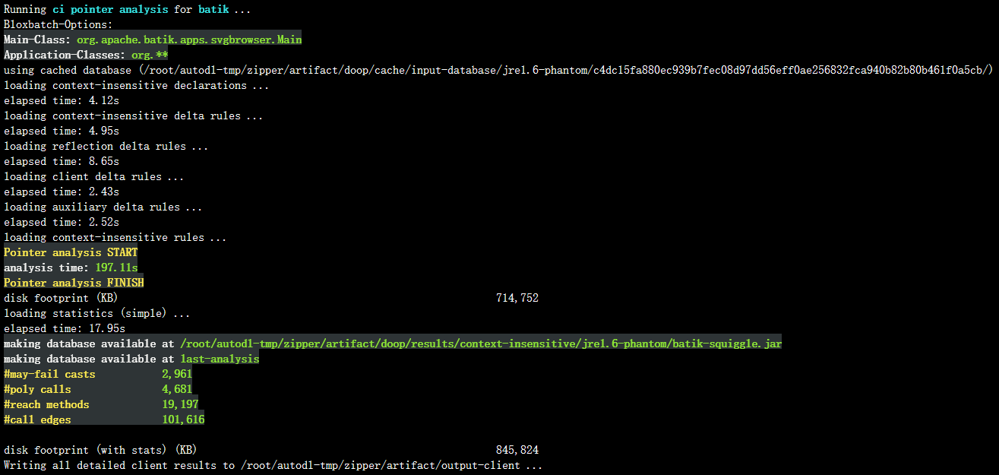
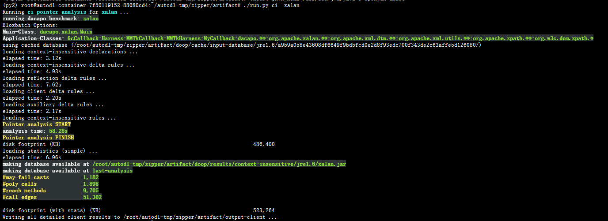
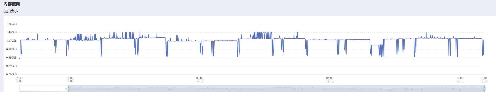
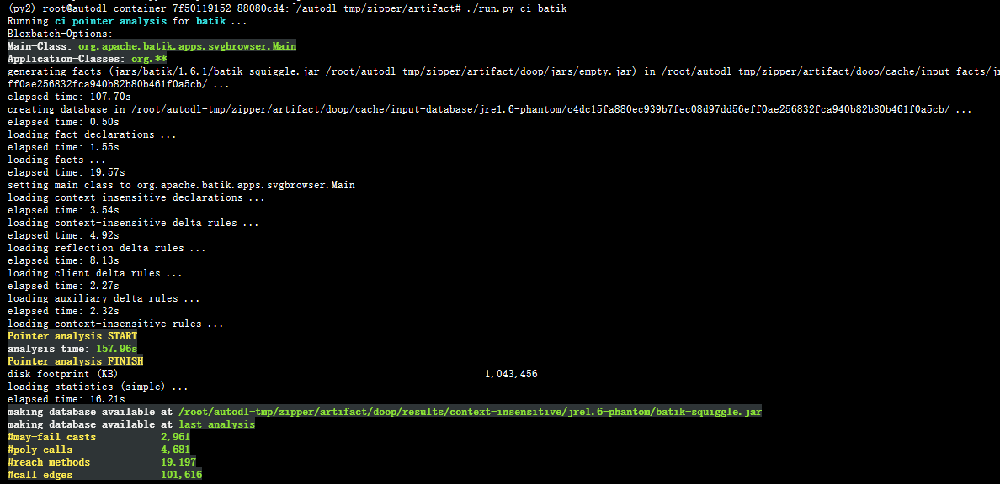

# 论文代码复现指引与记录

## 环境配置

### 方法一：Docker虚拟环境

#### 概述

根据项目需要，我们构建了一个基于 Ubuntu16.04 的 Docker 镜像，完成了项目运行所需环境的自动配置，在安装有 Docker 的机器上，只需要 clone 本项目并下载 PA-Datalog Engine，就可以傻瓜式地完成项目所需运行环境的搭建。

本项目的Docker file在[这里](https://github.com/NorthSecond/zipper/blob/master/dockerfile)下载，放置在项目根目录即可（本 Dockerfile 在服务本小组同学的同时，也很荣幸能够被某一其他小组的同学使用并亲测有效）。

#### PA-Datalog 下载

由于协议限制，PA-Datalog的安装只能通过手动下载 `.deb` 安装包来进行。下载地址为：[http://snf-705535.vm.okeanos.grnet.gr/agreement.html](http://snf-705535.vm.okeanos.grnet.gr/agreement.html)，在同意对应的协议后选择 Ubuntu16.04LTS 对应的版本执行下载。下载完成后，将安装包 `./datalog/pa-datalog_0.5-1xenial.deb` 放在项目目录下的 `/datalog` 文件夹即可。

#### Docker 镜像构建

在下载好 PA-Datalog Engine 后，执行以下命令即可构建项目对应的 Docker 镜像：

```bash
docker build -t zipper:0.1.5 .
```

构建完成后，可以通过以下命令查看镜像：

```bash
docker images
```

其中，`zipper:0.1.5` 为构建的镜像名，可以根据需要自行修改。

#### Docker 容器运行

在构建好镜像后，可以通过以下命令运行容器：

```bash
docker run -it --name zipper -v path/zipper:/home/zipper zipper:0.1.5
```

其中，`path/` 为本机上项目所在的地址，`zipper` 为容器名，可以根据需要自行修改。镜像中的 `/home/zipper` 为项目所在的目录，可以进行对应的运行。

如果使用 [VSCode](https://code.visualstudio.com/) 连接容器进行开发，可以通过以下命令运行容器以此来同步 VS Code 对应的设置项：

```bash
docker run --rm --name zipper -it -d -v ~/vscode-extension/.vscode-server:/root/.vscode-server -v path/zipper:/home/zipper zipper:0.1.5
```

其中，`~/vscode-extension/.vscode-server` 为 VS Code 的配置文件所在的目录，`path/zipper` 为项目所在的目录，可以根据需要自行修改。这里为了便于连接操作，我们将容器设置为后台运行，可以通过以下命令查看容器：

```bash
docker ps
```

---

### 方法二：Conda+本地环境（不推荐）

由于项目运行脚本的 Python 版本为 Python2，且项目代码运行环境需要 PA-Datalog 的支持，在这里仅做以环境配置说明，不推荐在本机直接运行。

#### 系统选择和工具下载

由于项目所需的 [PA-Datalog](http://snf-705535.vm.okeanos.grnet.gr/agreement.html) 对于新版本的Ubuntu支持存在问题（最高只支持到Ubuntu 18.04），因此目前相对常用的 Ubuntu 20.04/22.04 LTS 是很难完成版本配置的。我们这里使用的是 [Ubuntu 16.04 LTS](https://mirrors.tuna.tsinghua.edu.cn/ubuntu-releases/16.04/) ，链接对应清华大学开源软件镜像站的系统镜像。

在系统安装好之后，我们需要下载 PA-Datalog 安装包，点击[链接](http://snf-705535.vm.okeanos.grnet.gr/agreement.html)，选择对应的版本，同意许可协议之后下载对应的安装包（推荐使用.deb格式的安装包）。

安装好系统之后，为了便于在国内网络环境使用，建议进行 apt 换源和更新。由于在校园网内进行使用，我们使用在教育网上表现更好的清华大学开源软件镜像站tuna对应的软件源。具体操作如下：

首先对于 apt 源进行备份：
```bash
sudo cp /etc/apt/sources.list /etc/apt/sources.list.bak
```

然后对于 apt 源进行修改：

```bash
sudo sed -i "s@http://.*archive.ubuntu.com@https://mirrors.tuna.tsinghua.edu.cn@g" /etc/apt/sources.list
sudo sed -i "s@http://.*security.ubuntu.com@https://mirrors.tuna.tsinghua.edu.cn@g" /etc/apt/sources.list
```

修改完成之后，我们可以通过以下命令来更新系统依赖包：

```bash
sudo apt update
sudo apt upgrade
```

#### conda虚拟环境的构建

由于论文对应[项目](https://github.com/silverbullettt/zipper)运行脚本使用 Python2 编写，并且其中使用了很多诸如

```bash
./run.py
```

这样的调用语句，而 Ubuntu 16.04 对应处理 Python 文件的环境变量是 Python3. 虽然我们可以通过更改环境变量或者调用顺序的方式来解决这个问题，但是实测最稳定的方案始终是使用 Conda 新建一个 Python2 虚拟环境。

首先是安装 Conda，我们可以通过以下命令来安装 MiniConda：

```bash
wget https://mirrors.tuna.tsinghua.edu.cn/anaconda/miniconda/Miniconda3-latest-Linux-x86_64.sh
```

```bash
bash Miniconda3-latest-Linux-x86_64.sh
```

在安装好 Conda 之后，我们可以通过以下命令来创建一个 Python2 虚拟环境：

```bash
conda create -n py2 python=2.7
```

然后我们可以通过以下命令来检查是否安装成功，并在终端进入对应的 Conda 环境：

```bash
conda info --envs
source activate py2
```

#### JDK8的安装

由于项目运行需要 JDK8 的支持，因此我们需要安装 JDK8。在 Ubuntu 16.04 中，我们可以通过以下命令来安装 JDK8:

```bash
sudo apt-get install -y openjdk-8-jdk
```

使用下列命令设置 `${JAVA_HOME}` 环境变量：

```bash
export JAVA_HOME=/usr/lib/jvm/java-8-openjdk-amd64
```

值得注意的是这样设置是一次性的，仅在本终端中有效，若需要在所有终端中都进行对应操作，需要将上述命令写入 `~/.bashrc`文件中。

#### PA-Datalog的安装

在使用 dpkg 安装 PA-Datalog 之前，我们需要先安装依赖包，为了方便起见项目所需的一些其他依赖包也在这里一便安装：

```bash
 sudo apt-get install -y \
    libgoogle-perftools4 protobuf-compiler libprotobuf-dev libprotobuf-java libboost-date-time1.58.0  \
    libboost-filesystem1.58.0 libboost-iostreams1.58.0 libboost-program-options1.58.0 libboost-date-time1.58.0  \
    libboost-system1.58.0 libboost-thread1.58.0 libcppunit-1.13-0v5 realpath libboost-regex1.58.0 bc 
```

安装完成之后，我们通过终端进入已经下载好的 PA-Datalog 的安装包目录，然后通过以下命令来安装 PA-Datalog：

```bash
sudo dpkg -i pa-datalog_0.5-1xenial.deb
```

如果安装过程中出现依赖包缺失的情况，我们可以通过以下命令来安装缺失的依赖包：

```bash
sudo apt-get install -f
```

在完成安装之后，我们需要运行 PA-Datalog 提供的脚本文件进行环境变量的设置：

```bash
sudo source /opt/lb/pa-datalog/lb-env-bin.sh
```

至此，我们已经完成了项目环境的配置，接下来就可以进行项目运行和代码的复现了。

---

## 项目运行

论文对应的代码有两个版本，一个是谭添老师开源在 Github 上的[代码仓库](https://github.com/silverbullettt/zipper)，该仓库包含本小组阅读的[Precision-Guided Context Sensitivity for Pointer Analysis](https://silverbullettt.bitbucket.io/papers/oopsla2018.pdf)和ZIPPER-e in TOPLAS'20 "[A Principled Approach to Selective Context Sensitivity for Pointer Analysis](https://silverbullettt.bitbucket.io/papers/toplas2020.pdf)对应的所有代码。而在李越老师的[主页](https://yuelee.bitbucket.io/)上，他为这篇论文提供了一个 [Artifact](https://yuelee.bitbucket.io/software/zipper/)，包含了所有代码和可以复现论文结果的分析数据。

为了直接复现数据，我们使用李越老师提供的Artifact。下载压缩包解压后可以看见，两位老师为项目的运行提供了便于环境配置的 `getting-started.pdf` 和便于直接复现论文结果的 `step-by-step.pdf` 两个文档。我的复现也是基于这两篇文档的。

最简单粗暴的复现方式是进入 Artifact 文件夹后直接运行

```bash
./run.py -all
```

这条命令会自动运行论文中的所有的测试用例（对应论文表1-3，图11-12），生成所有的结果在项目根目录的三个output开头的文件夹中。但是这样做的话，我们需要等待很长时间。为了节省时间，我们可以选择只运行论文中的部分方法和测试用例。具体运行方式如下：

---

### 进行传统指针分析

这部分对应了论文的中的**表1，表3和图12**. 使用代码进行指针分析的命令一般形式如下：

```bash
./run.py <ANALYSIS>|-all <PROGRAM> [-flow <FLOW>]
```

其中，参数 `<ANALYSIS>` 在本项目中可以是下述几种指针分析方式的其中一种（`-all` 命令可以分析所有）：

```bash
ci, 2obj, zipper-2obj, introA-2obj, introB-2obj
```

其中，前两种是 DOOP 提供的 Baseline，中间一种是object-sensitive的分析方法，后两个用例对应的则是 introspective 的指针分析。

而参数 `<PROGRAM>` 则是我们要进行分析的作为测试用例的 Java 程序，在本 Artifact 中提供了下列几种：

```bash
batik, checkstyle, sunflow, findbugs, jpc, eclipse, chart, fop, xalan, bloat
```

最后，可选参数 `-flow <FLOW>` 对应的是论文 4.3 节中评估的四种流组合。当然，如果不指定 `-flow` 参数，那么默认的流组合就是我全都要的第四种。

```bash
Direct, Direct+Wrapped, Direct+Unwrapped, Direct+Wrapped+Unwrapped
```

举个栗子，我们可以运行

```bash
./run.py zipper-2obj xalan -flow Direct+Wrapped
```

这条命令就会使用 ` zipper-2obj` 指针分析方法对于 `xalan` 这个测试用例进行指针分析，同时使用 direct flow 和 waapped flow 两种方式。

---

### 使用ZIPPER进行分析

这部分对应了论文的中的**表2和图11**。

运行 ZIPPER 的命令一般形式如下：


```bash
 ./run.py zipper <PROGRAM> [-flow <FLOW>]
```

其中的参数 `<PROGRAM>` 和 `-flow <FLOW>` 的含义和上面的一样，

比如我们运行

```bash
./run.py zipper xalan -flow Direct+Wrapped
```

就可以使用 ZIPPER 通过 direct flow 和 waapped flow 两种方式对于 `xalan` 这个测试用例进行分析。

需要注意的一点是ZIPPER需要预分析生成的指向信息。因此，当运行ZIPPER时，首先将自动调用上下文不敏感的指向分析，作为我们的论文第3节中的预分析。在预分析之后，指向信息将被ZIPPER转储以供以后使用。对于 `batik` 等大型程序，转储可能需要几分钟时间。下面是一个典型的运行输出结果截图：



在运行过程中，运行结果除了会打印在终端之外，所有的运行输出都会被保存在 `artifact/output-zipper` 目录中。在目录中，对于每个流模式和程序的组合，ZIPPER将生成一个文件 `<PROGRAM>-ZipperPrecisionCriticalMethod-<FLOW>.facts` ，保存ZIPPER分析得到的结果，这个结果也可以被 DOOP 用来执行 ZIPPER 引导的指针分析。

---

### 运行附录中的实验

在论文附录A的 Table 6 中，详细记录了用于上下文不敏感(ci)、常规类型敏感(2type)、zip -guided (zip -2type)和内省类型敏感(introX-2type)指针分析的性能和精度度量。

#### 批量运行方法

和上面的实验部分相似，作者也提供了一个批量运行表中所有实验的命令：

```bash
./run.py -appendix
```

#### 逐个运行方法

运行表中指定实验的一般指令如下：

```bash
./run.py <ANALYSIS> <PROGRAM>
```

和上面的指令一样，参数 `<ANALYSIS>` 有下面几种运行方式可选：

```bash
ci, 2type, zipper-2type, introA-2type, introB-2type.
```

参数 `<PROGRAM>` 和[2.1节](#进行传统指针分析)中可选的分析程序一致。下面是运行

```bash
./run.py ci  xalan
```

的结果截图，和表格中的数据基本一致。



---

## 复现结论

### 实验环境

我在[AutoDL](https://www.autodl.com)中租借使用了一个服务器镜像进行代码的复现，详细配置如下：

+ CPU：12v CPU Intel(R) Xeon(R) Platinum 8255C CPU @ 2.50GHz（Docker）

+ 内存：43GB
+ 软件：Miniconda conda3（租借的服务器实例本质上也是一个虚拟化环境，Docker套Docker不太现实）

---

### 实验情况

按照[1.2节](#方法二：Conda+本地环境（不推荐）)的方法进行实验配置后，我使用命令

```bash
./run.py -all
```

进行批量运行，运行截图在上述小节中已经贴出，而在本环境下，完整运行一次的时间大约是25小时。大致资源使用曲线如下图所示：



由于 DOOP 始终将所有结果都写入磁盘中，总共花费了我们大约 130GB 的磁盘空间。

---

### 实验结论

对我们复现的结果和论文进行比对，我们发现由于配置的差别，我们的实验精度结果和论文中的实验结果一致，但是性能度量整体上比论文结果偏慢一倍左右。举例说明，对于表6中的第一行结论，我们运行

```bash
./run.py ci batik
```

进行复现，如下图所示：



可以看到我们的精度度量和论文一致，但是 157.96s 的时间相比论文中 82s 慢了不少。在实验过程中甚至有超过 3600s 上限被强制中断的指针分析过程。

但是可以肯定的是，这种偏差是整体的而不是个别的，论文整体说明的效率提高我们也是成功复现出的。
